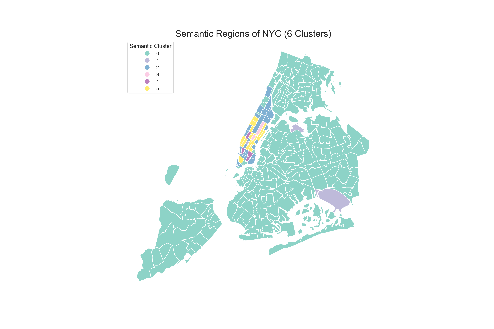

# This string contains the full text for your README.md file.
# Copy the text (starting from # Project 2...) and paste it into a new file.

readme_content = """
# Project 2: Semantic Mobility Analyzer for NYC Taxi Trajectories

This project analyzes a large-scale taxi trajectory dataset to discover "functional regions" in New York City. It moves beyond simple hotspot mapping by clustering taxi zones based on their complete 24/7 activity profiles, allowing for the inference of semantic meaning (e.g., "Work Zone," "Residential Zone," "Nightlife Hub").

The core methodology is a practical implementation of the spatio-temporal data mining framework described in the paper:
[cite_start]**Ghosh, S., Ghosh, S. K., & Buyya, R. (2020). MARIO: A spatio-temporal data mining framework on Google Cloud to explore mobility dynamics from taxi trajectories. *Journal of Network and Computer Applications*, 164, 102692.** [cite: 23]

## Final Interactive Map

**(Open the `semantic_map_interactive.html` file in your browser to explore)**

### [Insert Screenshot of your Interactive Folium Map here]

---

## Methodology

This project follows the core concepts of the MARIO framework to analyze urban mobility.

1.  **Data Pre-processing:** The NYC Yellow Taxi dataset (Jan 2023) was loaded, cleaned, and enriched.
2.  [cite_start]**Define Functional Regions:** Instead of using arbitrary grids, we used the official **NYC Taxi Zones** as our pre-defined "functional regions"[cite: 24], the primary unit of analysis.
3.  [cite_start]**Define Mobility Events:** Following the paper, we defined **"mobility events"** as individual pick-ups and drop-offs[cite: 25].
4.  **Feature Engineering:** We aggregated these events to build a 96-dimension feature vector for each of the ~260 taxi zones. This vector represents the zone's complete activity profile, broken down by:
    * [cite_start]**Travel Demand** (Pick-ups) [cite: 26] & Drop-offs
    * **Time Slot** (24 hours)
    * **Day Type** (Weekday vs. Weekend)
5.  **Clustering & Semantic Analysis:**
    * The 96-dimension feature matrix was normalized using `StandardScaler` to ensure clustering was based on pattern *shape*, not just *volume*.
    * `KMeans` clustering was used to group the ~260 zones into 6 distinct "semantic clusters."
    * [cite_start]By plotting the average 96-dimension profile for each cluster, we can infer its real-world function (e.g., "Source" vs. "Sink")[cite: 27].

---

## Semantic Cluster Profiles

The 6 clusters discovered by the model show distinct, human-understandable patterns.

### [Insert your Cluster Profile plots from Phase 3 here]

**Example Analysis:**

* **Cluster 0 (Work Zone / Sink):** This cluster shows a massive spike in **Weekday Drop-offs** between 7-10 AM and a corresponding spike in **Weekday Pick-ups** between 4-7 PM. Activity on weekends is minimal. This is the classic signature of a "Work Zone."
* **Cluster 1 (Residential Zone / Source):** This cluster shows the opposite pattern: high **Weekday Pick-ups** in the morning and high **Weekday Drop-offs** in the evening, with moderate activity on weekends. This is a classic "Residential Zone."
* **Cluster 4 (Nightlife Hub):** This cluster is quiet all day but shows a dramatic spike in both pick-ups and drop-offs late at night (9 PM - 2 AM), especially on **Weekends**.

"""

print("--- README.md Content ---")
print(readme_content)
print("\n---")
print("ACTION: Copy the text above and save it as README.md in your project folder.")